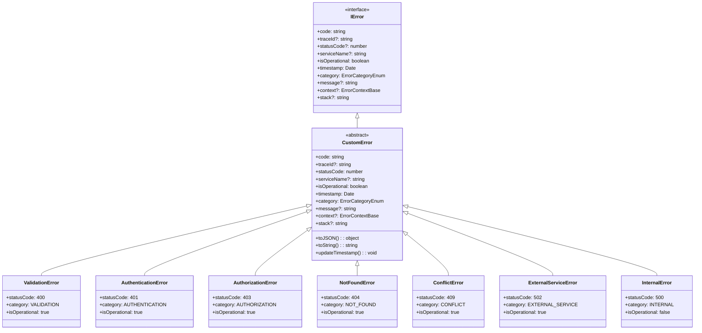
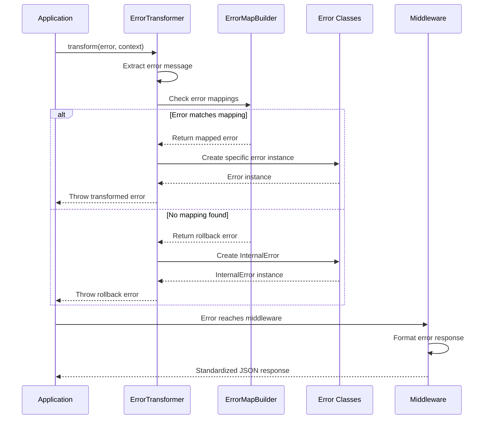
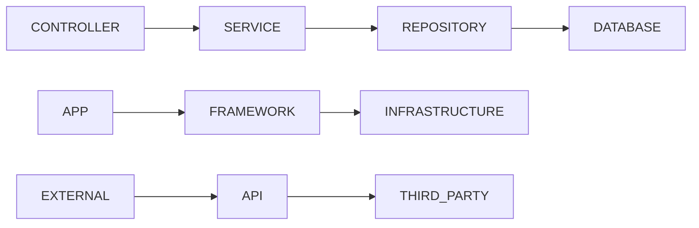

# @lazy-js/error-guard

[](https://www.typescriptlang.org/)
[](https://opensource.org/licenses/ISC)

A comprehensive, production-ready error handling library for Node.js applications with TypeScript support. Features advanced error transformation, framework integration (Express.js & NestJS), and structured error management.

## 🚀 Features

-   **🎯 Standardized Error Types**: 10+ specialized error classes with proper HTTP status codes
-   **🔄 Error Transformation**: Flexible error mapping with multiple matching strategies
-   **🏗️ Framework Integration**: Built-in support for Express.js and NestJS
-   **📊 Rich Context**: Comprehensive error context with debugging information
-   **🔍 Trace ID Support**: Distributed tracing capabilities
-   **⚡ Decorator Pattern**: Method-level error transformation with decorators
-   **🛡️ Type Safety**: Full TypeScript support with strict typing
-   **📦 Dual Build**: ESM and CommonJS support

## 📦 Installation

```bash
npm install github:lazy-js/error-guard
```

## 🏗️ Architecture Overview

### Package Structure

```mermaid
graph TB
    subgraph "Error Handler Package"
        A[Core] --> B[Error Classes]
        A --> C[ErrorTransformer]
        A --> D[ErrorMapBuilder]
        A --> E[ErrorFactory]

        F[Middleware] --> G[ExpressErrorHandler]
        F --> H[NestJSExceptionFilter]

        I[Decorators] --> J[AsyncTransform]
        I --> K[SyncTransform]
        I --> L[CustomValidators]

        M[Types] --> N[Error Interfaces]
        M --> O[Context Types]
        M --> P[Framework Types]

        Q[Enums] --> R[Error Categories]
        Q --> S[Error Layers]
        Q --> T[Error Codes]
    end

    subgraph "External Dependencies"
        U[class-transformer]
        V[class-validator]
        W[zod]
    end

    A --> U
    A --> V
    A --> W
```



### Class Hierarchy



## 🔄 Error Transformation Flow



## 📚 Quick Start

### Basic Error Usage

```typescript
import { ValidationError, NotFoundError, InternalError, ErrorTransformer, ErrorMapBuilder } from '@lazy-js/error-guard';

// Create specific error types
const validationError = new ValidationError({
    code: 'INVALID_EMAIL',
    message: 'Email format is invalid',
    context: {
        layer: 'SERVICE',
        className: 'UserService',
        methodName: 'validateEmail',
        providedValue: 'invalid-email',
        expectedValueType: 'email',
    },
});

// Use error transformer
const errorMapBuilder = new ErrorMapBuilder({
    globalProperty: 'message',
    rollbackError: new InternalError({ code: 'UNKNOWN_ERROR' }),
});

errorMapBuilder
    .equals('User not found')
    .throwString('USER_NOT_FOUND')
    .includes(['validation', 'failed'])
    .throwErrorInstance(validationError);

const transformer = new ErrorTransformer({
    errorMap: errorMapBuilder,
    moduleName: 'user-service',
});
```

### Express.js Integration

```typescript
import express from 'express';
import { ExpressErrorHandlerMiddleware } from '@lazy-js/error-guard';

const app = express();

// Configure error handler
const errorHandler = new ExpressErrorHandlerMiddleware({
    serviceName: 'my-api',
    traceIdHeader: 'x-trace-id',
    includeRequestBody: true,
    maxBodySize: 2048,
});

// Use as global error handler
app.use(errorHandler.handler);

// Your routes
app.get('/users/:id', async (req, res) => {
    // This will be caught by the error handler
    throw new NotFoundError({
        code: 'USER_NOT_FOUND',
        message: `User with ID ${req.params.id} not found`,
    });
});
```

### NestJS Integration

```typescript
import { Module } from '@nestjs/common';
import { APP_FILTER } from '@nestjs/core';
import { NestJSGlobalExceptionFilter } from '@lazy-js/error-guard';

@Module({
    providers: [
        {
            provide: APP_FILTER,
            useClass: NestJSGlobalExceptionFilter,
        },
    ],
})
export class AppModule {}
```

### Decorator Usage

```typescript
import { AsyncTransform, SyncTransform } from '@lazy-js/error-guard';

class UserService {
    private errorTransformer = new ErrorTransformer({
        errorMap: this.buildErrorMap(),
        moduleName: 'user-service',
    });

    @AsyncTransform({
        layer: 'SERVICE',
        className: 'UserService',
    })
    async getUserById(id: string): Promise<User> {
        const user = await this.userRepository.findById(id);
        if (!user) {
            throw new Error('User not found');
        }
        return user;
    }

    @SyncTransform({
        layer: 'SERVICE',
        className: 'UserService',
    })
    validateUserData(userData: any): void {
        if (!userData.email) {
            throw new Error('Email is required');
        }
    }
}
```

## 🎯 Error Types

| Error Class            | Status Code | Category         | Use Case                          |
| ---------------------- | ----------- | ---------------- | --------------------------------- |
| `ValidationError`      | 400         | VALIDATION       | Input validation failures         |
| `AuthenticationError`  | 401         | AUTHENTICATION   | Authentication failures           |
| `AuthorizationError`   | 403         | AUTHORIZATION    | Permission/authorization failures |
| `NotFoundError`        | 404         | NOT_FOUND        | Resource not found                |
| `ConflictError`        | 409         | CONFLICT         | Resource conflicts                |
| `ExternalServiceError` | 502         | EXTERNAL_SERVICE | External API failures             |
| `InternalError`        | 500         | INTERNAL         | Internal server errors            |

## 🔧 Error Transformation

### Matching Strategies

```typescript
const errorMapBuilder = new ErrorMapBuilder({
    globalProperty: 'message',
    rollbackError: new InternalError({ code: 'UNKNOWN_ERROR' }),
});

// Exact match
errorMapBuilder.equals('User not found').throwString('USER_NOT_FOUND');

// Partial match (all keywords must be present)
errorMapBuilder
    .includes(['validation', 'failed'])
    .throwErrorInstance(new ValidationError({ code: 'VALIDATION_FAILED' }));

// Regex match
errorMapBuilder.matches(/^HTTP \d{3}:/).throwString('HTTP_ERROR');

// Custom error instance
const customError = new NotFoundError({
    code: 'RESOURCE_NOT_FOUND',
    message: 'The requested resource was not found',
});

errorMapBuilder.equals('Resource not found').throwErrorInstance(customError);
```

## 📊 Error Context

```typescript
interface ErrorContextBase {
    layer?: ErrorLayerEnum;
    className?: string;
    methodName?: string;
    transformerModuleName?: string;
    originalError?: Error;
    [key: string]: any; // Custom context properties
}

// Example usage
const error = new ValidationError({
    code: 'INVALID_INPUT',
    message: 'Invalid user input provided',
    context: {
        layer: 'SERVICE',
        className: 'UserService',
        methodName: 'createUser',
        providedValue: { email: 'invalid' },
        expectedValueType: 'object',
        validationErrors: ['email is required'],
    },
});
```

## 🛠️ API Reference

### Core Classes

#### `CustomError`

Base class for all custom errors.

```typescript
class CustomError extends Error implements IError {
    constructor(options: ErrorOptions);

    // Properties
    readonly code: string;
    readonly traceId?: string;
    readonly statusCode: number;
    readonly serviceName?: string;
    readonly isOperational: boolean;
    readonly timestamp: Date;
    readonly category: ErrorCategoryEnum;
    readonly message?: string;
    readonly context?: ErrorContextBase;
    readonly stack?: string;

    // Methods
    toJSON(): object;
    toString(): string;
    updateTimestamp(): void;
}
```

#### `ErrorTransformer`

Transforms errors based on configured mappings.

```typescript
class ErrorTransformer {
    constructor(config: ErrorTransformerConfig);

    // Methods
    transform(error: ErrorInput, context?: ErrorContextBase): never;
    withAsyncTransform<T>(fn: () => Promise<T>, context?: ErrorContextBase): () => Promise<T>;
    withSyncTransform<T>(fn: () => T, context?: ErrorContextBase): () => T;
}
```

#### `ErrorMapBuilder`

Builds error mapping configurations.

```typescript
class ErrorMapBuilder {
    constructor(config: ErrorMapBuilderConfig);

    // Methods
    equals(value: string): ErrorMapBuilder;
    includes(values: string[]): ErrorMapBuilder;
    matches(regex: RegExp): ErrorMapBuilder;
    throwString(errorCode: string): ErrorMapBuilder;
    throwErrorInstance(error: ErrorInstance): ErrorMapBuilder;
}
```

### Middleware

#### `ExpressErrorHandlerMiddleware`

Express.js error handling middleware.

```typescript
class ExpressErrorHandlerMiddleware {
    constructor(options?: ExpressErrorHandlerOptions);

    // Methods
    handler(error: Error, req: Request, res: Response, next: NextFunction): void;
}
```

#### `NestJSGlobalExceptionFilter`

NestJS global exception filter.

```typescript
@Catch()
class NestJSGlobalExceptionFilter implements ExceptionFilter {
    constructor(options?: NestJSExceptionFilterOptions);

    // Methods
    catch(exception: unknown, host: ArgumentsHost): void;
}
```

### Decorators

#### `@AsyncTransform`

Decorator for async method error transformation.

```typescript
function AsyncTransform(context?: Partial<ErrorContextBase>): MethodDecorator;
```

#### `@SyncTransform`

Decorator for sync method error transformation.

```typescript
function SyncTransform(context?: Partial<ErrorContextBase>): MethodDecorator;
```

## 🔍 Error Layers



## 🧪 Testing

```bash
# Run tests
npm test

# Run tests with coverage
npm run test:coverage

# Run tests in watch mode
npm run test:watch
```

## 📦 Build

```bash
# Build for production
npm run build

# Development build with watch
npm run dev

# Build ESM only
npm run build:esm

# Build CommonJS only
npm run build:cjs
```

## 🤝 Contributing

1. Fork the repository
2. Create your feature branch (`git checkout -b feature/amazing-feature`)
3. Commit your changes (`git commit -m 'Add some amazing feature'`)
4. Push to the branch (`git push origin feature/amazing-feature`)
5. Open a Pull Request

## 📄 License

This project is licensed under the ISC License - see the [LICENSE](LICENSE) file for details.

## 🙏 Acknowledgments

-   Built with TypeScript for type safety
-   Integrates with popular Node.js frameworks
-   Inspired by best practices in error handling
-   Community feedback and contributions

### Third-Party Libraries

This package re-exports the following excellent libraries:

-   **class-transformer** - MIT License - Object transformation library
-   **class-validator** - MIT License - Decorator-based validation library

---

**Made with ❤️ by the Lazy JS team**
