# Error Handler Package Diagrams

This document contains detailed Mermaid diagrams for the @lazy-js/error-guard package.

## Package Architecture

### High-Level Package Structure

```mermaid
graph TB
    subgraph "Error Handler Package"
        A[Core] --> B[Error Classes]
        A --> C[ErrorTransformer]
        A --> D[ErrorMapBuilder]
        A --> E[ErrorFactory]

        F[Middleware] --> G[ExpressErrorHandler]
        F --> H[NestJSExceptionFilter]

        I[Decorators] --> J[AsyncTransform]
        I --> K[SyncTransform]
        I --> L[CustomValidators]

        M[Types] --> N[Error Interfaces]
        M --> O[Context Types]
        M --> P[Framework Types]

        Q[Enums] --> R[Error Categories]
        Q --> S[Error Layers]
        Q --> T[Error Codes]
    end

    subgraph "External Dependencies"
        U[class-transformer]
        V[class-validator]
        W[zod]
    end

    A --> U
    A --> V
    A --> W
```

### Detailed Class Hierarchy

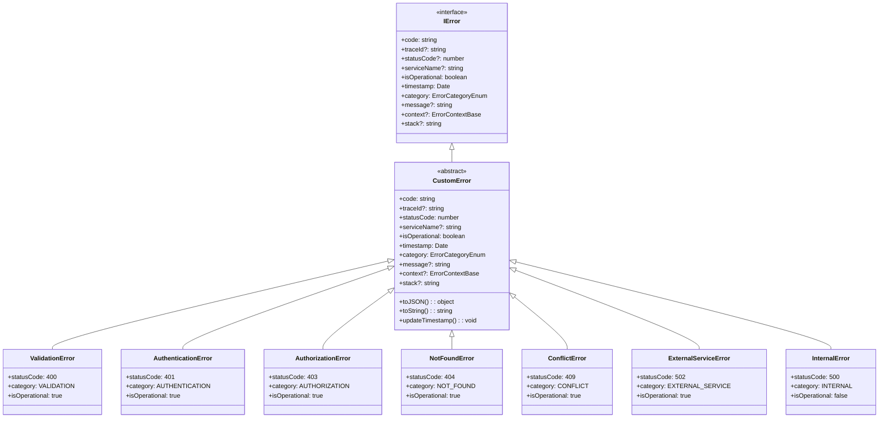

## Error Transformation Flow

### Basic Error Transformation Sequence

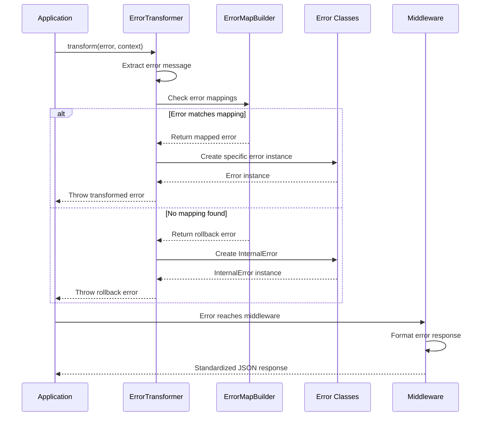

### Error Map Building Process

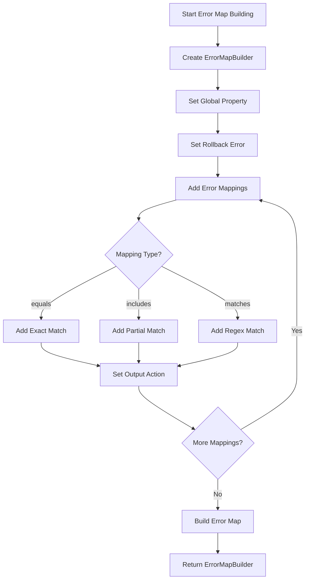

### Error Context Flow

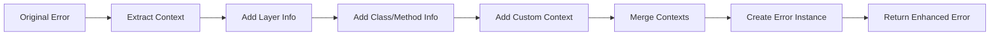

## Framework Integration

### Express.js Integration Flow

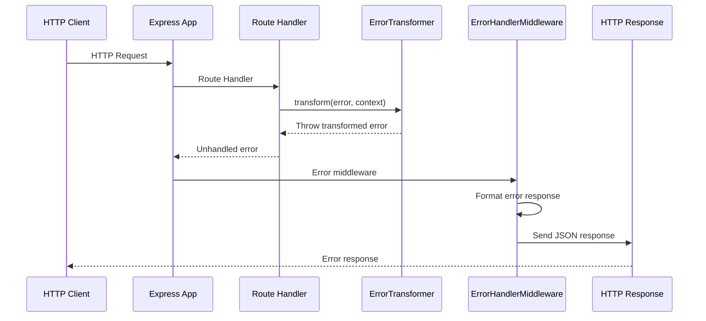

### NestJS Integration Flow

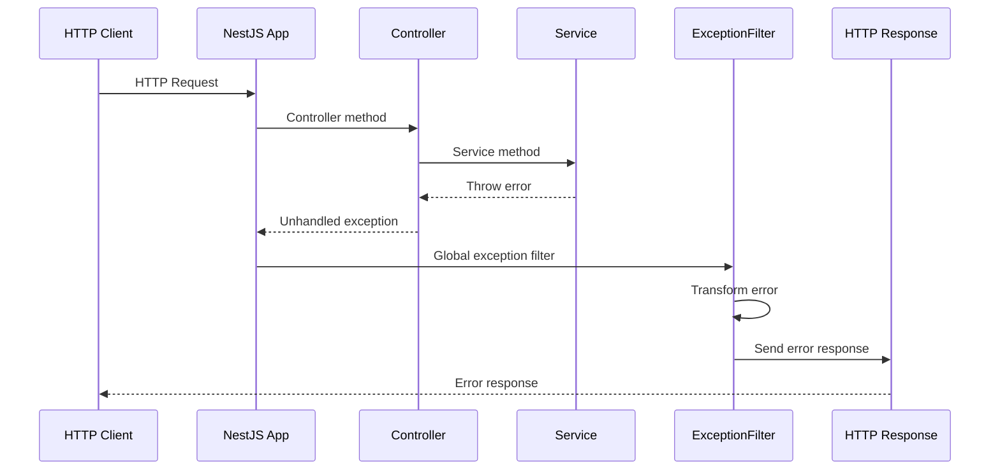

## Error Layers Architecture

### Error Layer Hierarchy

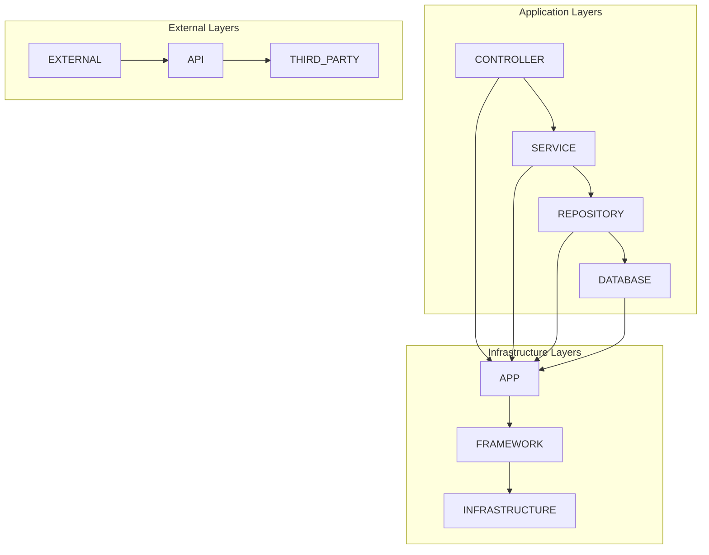

### Error Flow Through Layers

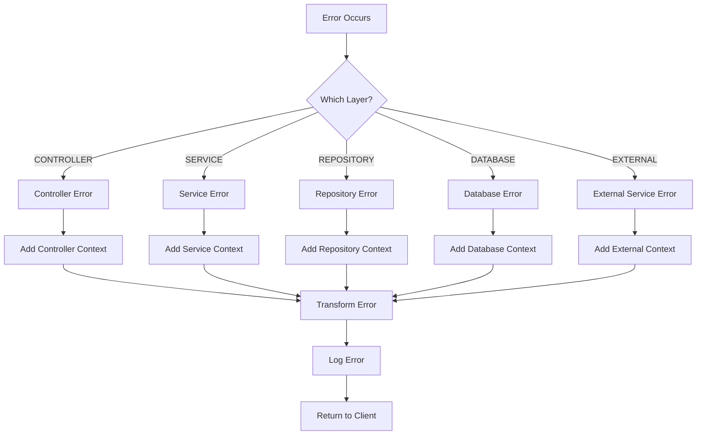

## Decorator Pattern Implementation

### Decorator Flow

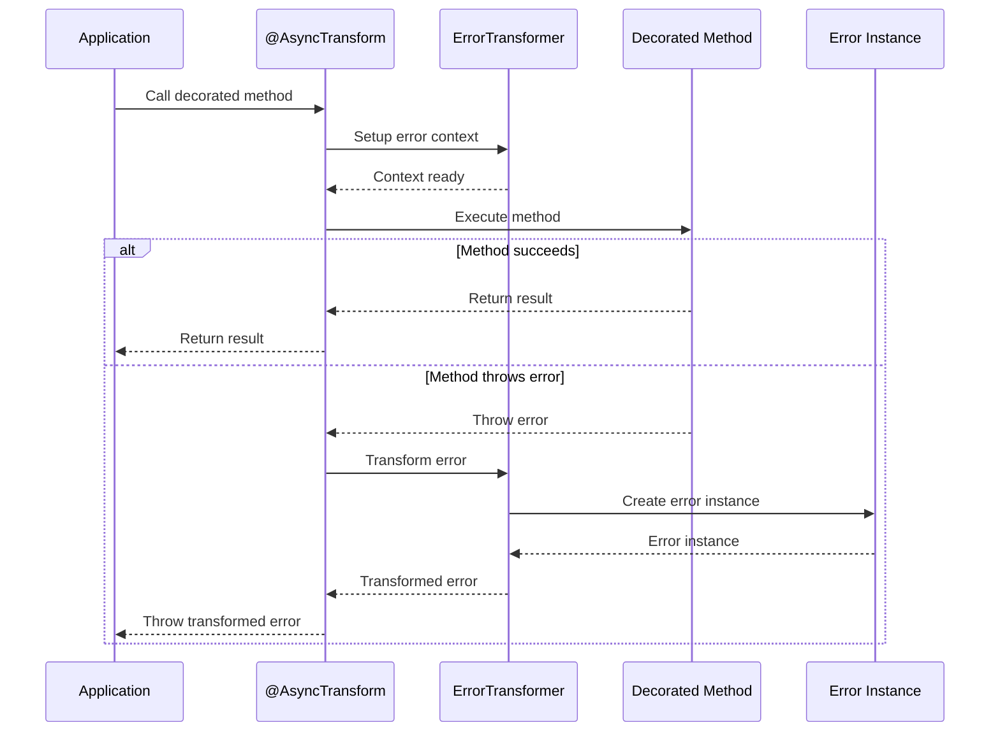

### Decorator Class Structure

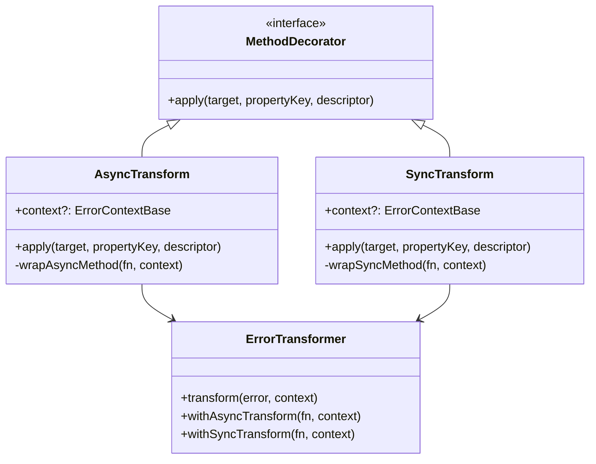

## Error Map Configuration

### Error Map Structure

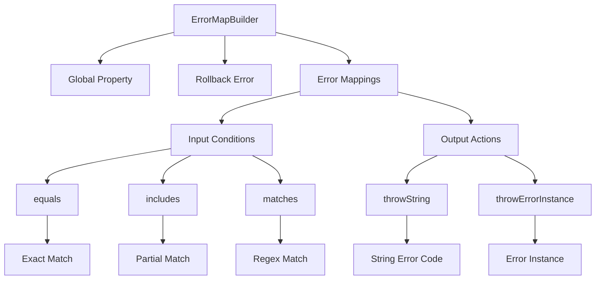

### Error Matching Process

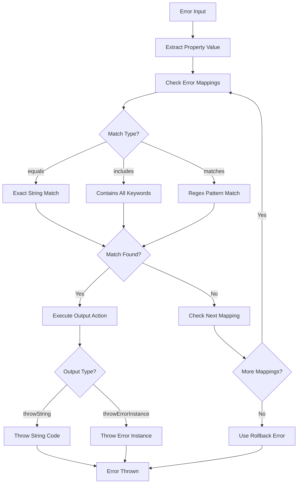

## Testing Architecture

### Test Structure

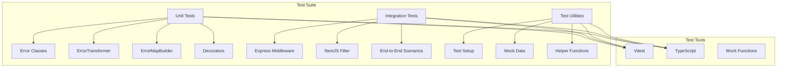

This comprehensive set of diagrams provides a complete visual understanding of the error handler package architecture, data flow, and integration patterns.
